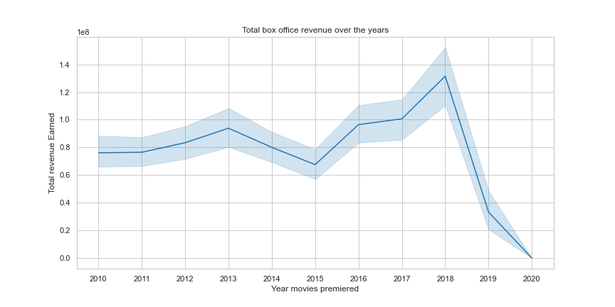
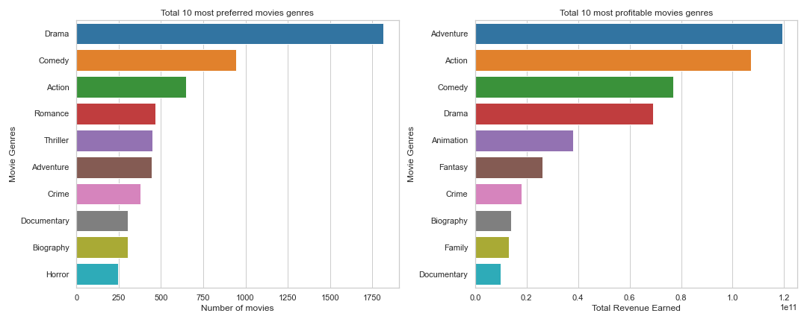
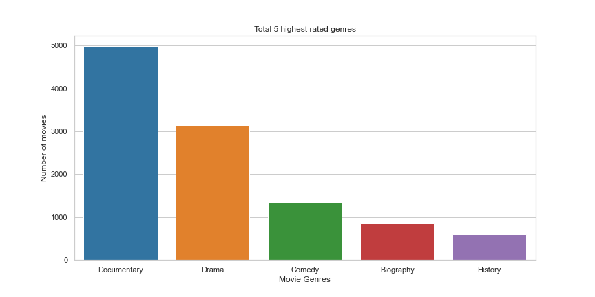
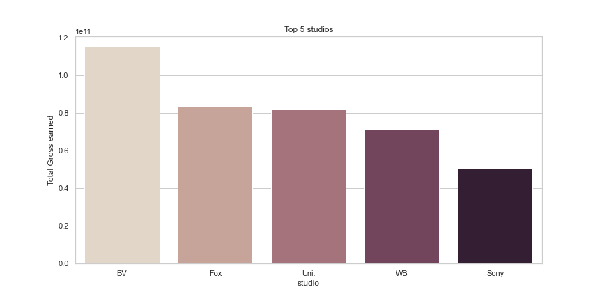

# Microsoft Movie Analysis - Phase 1 Project


### Author: Fridah Kimathi

## Overview
***

Microsoft wishes to create a new movie studio but they have limited knowledge on movie creation. Analysis was made using genres, total gross earnings over the years and ratings. From this analysis, the following recommendations were made: 
<ol type='i'> 
<li> Create a streaming platform for their movies </li>
<li> Produce movies that have a combination of adventure, action, comedy and drama </li>
<li> Benchmark with top earning movie studios such as BV studios</li>
</ol>

### Business Problem
***
Due to Microsoft's lack of knowledge in the creation of movies, the following business questions were asked to solve this problem.

***

Questions to considered:
* What are the business's pain points related to this project?
Microsoft has very little knowledge about the creation of movies and are unsure of what movies they should produce in there new movie studio

* How did you pick the data analysis question(s) that you did?
Genre, rating and gross earnings were used to pick the business questions.

* Why are these questions important from a business perspective?
Microsoft can be able to make informed decisions on the type of movie genres to produce.

***

### The Data
***
This project used 3 datasets, two from _imbd_ and one from _bom_.
***
Questions to considered:

* Where did the data come from, and how do they relate to the data analysis questions?
BOM movie_gross dataset has important columns such as  studio, domestic_gross and foreign_gross.
IMBD title basics dataset has substantial columns such as start_year, runtime_minutes and genres.
IMBD ratings dataset has important columns such as average rating and number of votes 

* What is the target variable?
The target variables were genres, start_year(movie release year), the total_gross (combination of domestic and foreign gross)

***

## Methods
Data cleaning, analysis and visualization

***
The three datasets were imported, cleaned, merged and irrelevant columns dropped. 
 Data cleaning was done by:
* Identifying duplicates:
Duplicates were identified using the title column and start year columns. Duplicates were dropped were maintaining entries with the least amount of missing values.
* Identifying missing values.
A function was created to print out columns that had missing values in each dataset. The genre column for the IMBD title basics dataset had  missing values which comprised 3% of the data, which is a small percentage hence those rows were dropped. 
* Changing data types 
Data types for all three datasets were checked using the _.dtypes_ attribute. Any incorrect data types such as that of the foreign gross column were changed using appropriate method.
* Flattened the genre column
The values of each row in the genre column were split into a list. Transformation of each element of the list of genre categories into a row, replicating index values was done.
* Checking for placeholders or outliers
A function was defined to print out the contents of each column. The data had no placeholders.There were outliers in the start year column. Some years are in the future. This years were targeted and removed. 
* Merging of data sets
The datasets were then merged and irrelevant columns dropped.

For data analysis, the following was done:
* Visualization of the total box office revenue over the years was done using a line plot.
* A comparison between the top_10 most preferred movie genres _Vs_ the top_10 most profitable movie genres was done by plotting a bar plot in the same figure with different axes.
* The top 5 highest rated genres were visualized using a bar plot.
* The correlation between Average rating and total gross was done visualized using a scatter plot.
*  A visualization of the top 5 studios based on total revenue earned was done using a bar plot.

*** 

## Results

Interpreting the results

***
**_Observations for Total box office revenue over the years_**:
 <ul type='square'> 
    <li>Movies made a lot of money in 2018. </li>
    <li>There has been a sharp decrease in total gross earned by movies since 2018, with the lowest year being 2020. </br>
        This makes sense since streaming platforms started gaining a lot of hype in 2018, leading to lot of people preferring to stream movies on platforms such as Netflix hence the decline in box office revenues.</li>
     <li>Movies made zero box office revenue in 2020. </br>
        This is because COVID started in 2020, which lead to the closure of movie theaters in a lot of countries hence there was no box office revenue for movies that year.
     </li>
 </ul>
 
 **_Observations for the preferred movie genres _Vs_ The most profitable movie genres_**:
<ul> 
       <li>Drama is the most preferred movie genre. </li>
       <li>Romance, Thriller, Horror which are in the top 10 most preferred movies is not in the top 10 most profitable movies </li>
      <li>Adventure is the most profitable movie genre. </li>
      <li> Animation, Fantasy and Family are in the top 10 most profitable movies but are not in the top 10 most preferred genres</li>
            
 </ul>

 **_Observations for the top 5 highest rated genres_**:
<ul type='square'> 
       <li>Documentary is the highest rated movie genre. </li>
       <li>The first four genres, that is Documentary, drama , comedy and biography are also in the top ten most preferred/profitable movies </li>
       <li>History is not in the top ten most preferred/profitable movies </li>          
 </ul>

 **_Observations for the correlation between Average rating and total gross_**:
<ul type='square'> 
       <li>There is no correlation between average rating and the total revenue earned </li>
       <li> Majority of movies make a total gross of less than 400 million dollars  </li>
        <li> Majority of movies have an average rating higher than 4  </li     
 </ul>

 **_Observations for the Top 5 studios based on total revenue earned_**:
<ul type='square'> 
       <li>BV studio is the highest earning studio </li>
       <li> Fox and Uni.Studio have approximately the same gross earnings</li>
        <li> All 5 studios have a gross total greater than 400 million dollars </li     
 </ul>

 Our generalizations have good grounding based off the data we have and therefore can aid to enabling Microsoft to make informed decisions of the movies they should make. The data analyzed was collected for the last 10 years therefore it is able to gives us pretty accurate insights. Missing values were carefully replaced to avoid skewed results.Data was aggregated where necessary to help give a clearer picture of the data.

### Visualizations
  * Total box office revenue over the years

           

   
  * Preferred movie genres _Vs_ The most profitable movie genres

   
  * Top 5 highest rated genres


  * The correlation between Average rating and total gross
 

  * Top 5 studios based on total revenue earned


***
## Conclusions
* There has been a sharp decrease in box office gross earnings since 2018. This can be attributed to the increase preference for movie streaming in platforms such as Netflix. 
* Adventure, action, comedy and drama are genres that are highly preferred by audiences and also have high profitability. 
* BV Studio has the highest total gross earnings.

## Recommendations

 From the results in my analysis, I recommended the following:
<ol type='i'> 
<li> Create a streaming platform for their movies </li>
<li> Produce movies that have a combination of adventure, action, comedy and drama </li>
<li> Benchmark with top earning movie studios such as BV studios</li>
</ol>

## Future Plans
<ol type='i'> 
<li> Determine profit based on the movie's budget </li>
<li> Compare streaming services gross earnings and box office gross earnings per movie </li>
<li> Assess the relationship between genre and number of votes or what influences the number of votes per movie</li>
</ol>


## For More Information

Please review my full analysis in [my Jupyter Notebook](https://github.com/FridahKimathi/Microsoft-Movie-Analysis/blob/master/Microsoft-Movie-Analyisis.ipynb) or my [presentation](https://github.com/FridahKimathi/Microsoft-Movie-Analysis/blob/master/Microsoft%20Movie%20Analysis%20PPT.pdf).

For any additional questions, please contact **Fridah Kimathi at fridahnkirotekimathi@gmail.com**

## Repository Structure

Describe the structure of your repository and its contents, for example:

```
├── images     <- Both sourced externally and generated from code
├── zippedData  <- Both sourced externally and generated from code
├── .canvas        
├── .gitignore 
└── Microsoft-Movie-Analyisis.ipynb   <- Narrative documentation of analysis in Jupyter notebook
└── Microsoft-Movie-Analysis-Presentation ppt  <- PDF version of project presentation          
└── README.md   <- The top-level README for reviewers of this project
                                                    
                                                    
```
